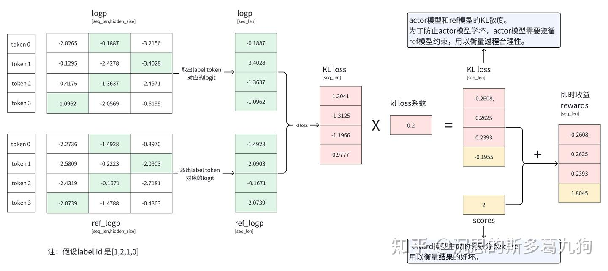
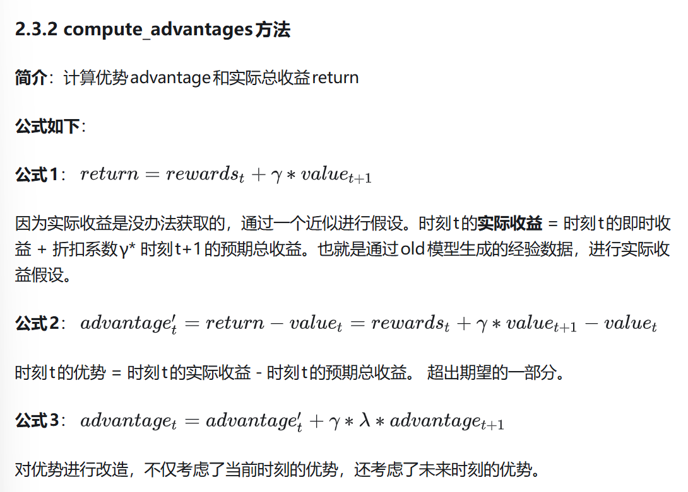
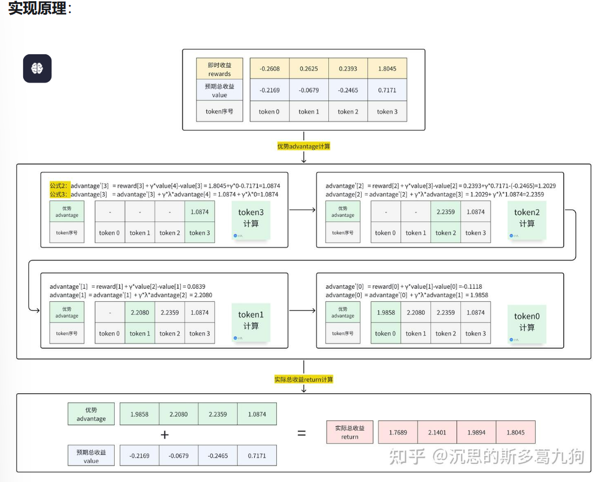
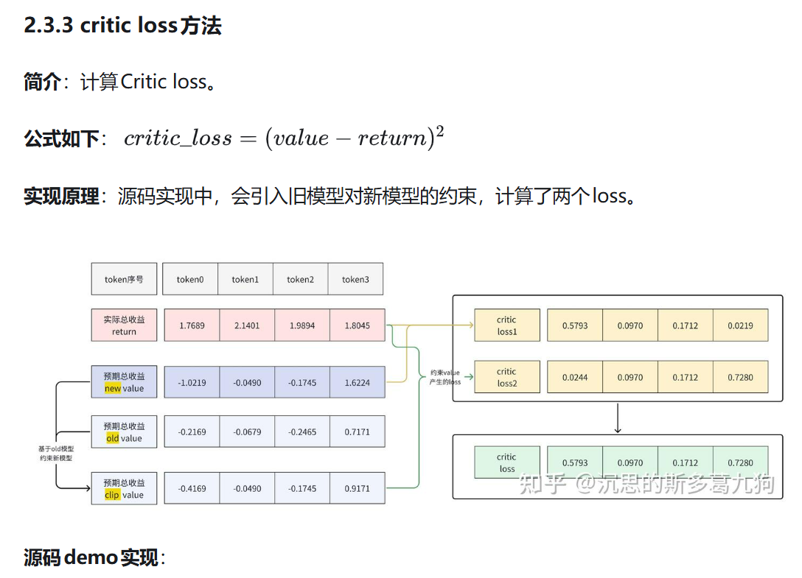
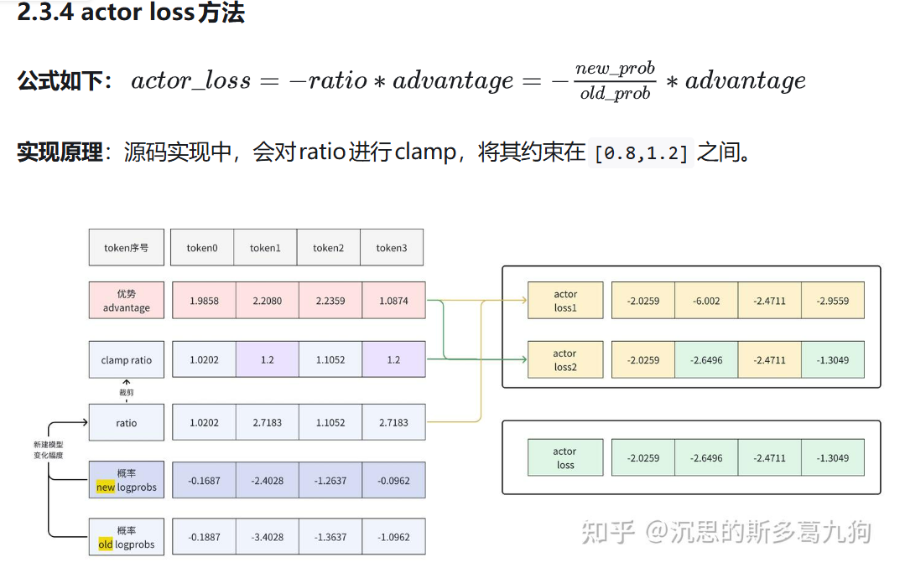

# 2025 PRML pj -- RL
TODO:
1. 主流奖励调研
RLHF
RLVR
DPO
2. baseline
TRL SFT 做RLHF+PPO的微调
3. 奖励机制分析
4. 改进奖励实现，对比性能
	正则化，塑性，多奖励权重平衡，更换设计

5. 论文
找related work

** 本README记录了比较多的一些代码阅读记录，如果想要看本仓库的代码运行结果可以到最后查看,一般在子仓库下有比较详细的代码运行指南

实验用到的代码环境和trl相同,可以看`environment.yml`

# PPO train 过程源码理解
【【PPO强化学习】TRL PPO源码分析】 https://www.bilibili.com/video/BV1wUezzXEDJ/?share_source=copy_web&vd_source=011f1df919a7aa6b4f2befc8a3e17259

两篇知乎上的讲PPO TRL 源码
https://zhuanlan.zhihu.com/p/707916971
https://zhuanlan.zhihu.com/p/708951596

源码分析
https://blog.csdn.net/taoqick/article/details/133048771

PPO 整体训练流程
1. rollout: 根据输入的prompt 生成response 响应，形成prompt--response 对
2. evaluation： 评估上面的 prompt--response, 通过reward模型给出奖励分数
3. optimization
根据 prompt--response 先 生成 经验数据，再优化模型

示意代码
```python
epochs = 10
for epoch in tqdm(range(epochs), "epoch: "):
    for batch in tqdm(ppo_trainer.dataloader): 
        query_tensors = batch["input_ids"]
    
        #1、通过SFTModel获得相应response。对应Rollout阶段。
        response_tensors = ppo_trainer.generate(query_tensors, **generation_kwargs)
        batch["response"] = [tokenizer.decode(r.squeeze()) for r in response_tensors]
    
        #2、计算 query+response的score得分。对应Evaluation阶段。
        texts = [q + r for q, r in zip(batch["query"], batch["response"])]
        pipe_outputs = reward_model(texts)
        rewards = [torch.tensor(output[1]["score"]) for output in pipe_outputs]
    
        #3、PPO的step训练。对应Optimization阶段
        stats = ppo_trainer.step(query_tensors, response_tensors, rewards)
        ppo_trainer.log_stats(stats, batch, rewards)
```

## PPO config 参数
具体看源码args地方
## Optimization阶段
源码： trl/trainer/ppo_trainer.py
训练： ppo_trainer.step()

### compute rewards
计算即时受益rewards, reward 模型的score只加在最后一个token上


```python
def compute_rewards():
    bs=1
    seq_len=4
    hidden_dim=3
    init_kl_coef = 0.2 #kl loss权重
    logits = torch.randn((bs,seq_len,hidden_dim))
    ref_logits = torch.randn((bs,seq_len,hidden_dim))
    labels = torch.ones((bs,seq_len)).long()# 假设都是1

    scores = torch.randn((bs)) #reward模型对每个响应的打分

    #获取指定label id的logits
    logp = F.log_softmax(logits, dim=2) #[bs,seq_len,hidden_dim]
    logprobs = torch.gather(logp, 2, labels.unsqueeze(2)).squeeze(-1)

    logp= F.log_softmax(ref_logits, dim=2)
    ref_logprobs = torch.gather(logp, 2, labels.unsqueeze(2)).squeeze(-1)

    rewards, kls = [], []
    for score, logprob, ref_logprob in zip(scores, logprobs, ref_logprobs):
        # kl 散度计算
        kl =  logprob - ref_logprob
        kls.append(kl)
        reward = -init_kl_coef * kl
        reward[-1] += score
        rewards.append(reward)
```

### compute advantages




```python
def compute_advantages():
    bs=1
    seq_len=4
    hidden_dim=3
    gamma=1
    lam=0.95
    lastgaelam=0
    rewards = torch.tensor([[-0.2608,0.2625,0.2393,1.8045]])
    values = torch.tensor([[-0.2169, -0.0679, -0.2465,  0.7171]])
    # rewards = torch.randn((bs,seq_len))
    # values=torch.randn((bs,seq_len))
    advantages_reversed = []

    for t in reversed(range(seq_len)):
        nextvalues = values[:, t + 1] if t < seq_len - 1 else 0.0
        delta = rewards[:, t] + gamma * nextvalues - values[:, t]
        lastgaelam = delta + gamma * lam * lastgaelam
        advantages_reversed.append(lastgaelam)
    advantages = torch.stack(advantages_reversed[::-1]).transpose(0, 1)
    returns = advantages + values
```

### critic loss

```python
def critic_loss():
    bs=1
    seq_len=4
    values_new = torch.tensor([[-1.0219, -0.0490, -0.1745,  1.6224]])
    values_old = torch.tensor([[-0.2169, -0.0679, -0.2465, 0.7171]])
    returns = torch.tensor([[-0.2608, 0.2625, 0.2393, 1.7703]])
    print("values_preds")
    print(values_new)
    #旧模型约束value
    cliprange_value=0.2
    values_clipped = torch.max(
        torch.min(values_new, values_old +cliprange_value),
        values_old - cliprange_value)
    #critic loss
    critic_losses1 = (values_new - returns) ** 2
    critic_losses2 = (values_clipped - returns) ** 2
    critic_loss = torch.max(critic_losses1, critic_losses2)
    critic_loss = 0.5*critic_loss.mean()
```

### actor loss



```python
def actor_loss():
    bs=1
    seq_len=4
    cliprange=0.2
    new_logprobs = torch.tensor([[-0.1687, -2.4028, -1.2637, -0.0962]])
    old_logprobs = torch.tensor([[-0.1887, -3.4028, -1.3637, -1.0962]])

    advantages = torch.tensor([[1.9858, 2.2080, 2.2359, 1.0874]])
    ratio = torch.exp(new_logprobs - old_logprobs)
    ratio_clamp= torch.clamp(ratio, 1.0 - cliprange, 1.0 + cliprange)

    actor_loss1 = -advantages * ratio
    actor_loss2 = -advantages * ratio_clamp
    actor_loss = torch.max(actor_loss1, actor_loss2)
    actor_loss=actor_loss.mean()
```
# PPO 具体源码
具体源码可以看PPO_trainer如下
```python
 # Response Processing 1. truncate response after the first occurrence of `stop_token_id`
                    postprocessed_response = response
                    if self.stop_token_id is not None:  # handle the edge case when stop_token_id exists but is 0
                        postprocessed_response = truncate_response(
                            self.stop_token_id, processing_class.pad_token_id, response
                        )

                    # Response Processing 2. run reward model on the truncated responses
                    postprocessed_query_response = torch.cat((query, postprocessed_response), 1)
                    sequence_length = first_true_indices(postprocessed_response == processing_class.pad_token_id) - 1
                    unwrapped_value_model = accelerator.unwrap_model(model).value_model
                    full_value, _, _ = get_reward(
                        unwrapped_value_model, query_response, processing_class.pad_token_id, context_length
                    )
                    value = full_value[:, context_length - 1 : -1].squeeze(-1)
                    _, score, _ = get_reward(
                        reward_model, postprocessed_query_response, processing_class.pad_token_id, context_length
                    )

                    responses.append(response)
                    postprocessed_responses.append(postprocessed_response)
                    logprobs.append(logprob)
                    ref_logprobs.append(ref_logprob)
                    sequence_lengths.append(sequence_length)
                    scores.append(score)
                    values.append(value)
                responses = torch.cat(responses, 0)
                postprocessed_responses = torch.cat(postprocessed_responses, 0)
                logprobs = torch.cat(logprobs, 0)
                ref_logprobs = torch.cat(ref_logprobs, 0)
                sequence_lengths = torch.cat(sequence_lengths, 0)
                scores = torch.cat(scores, 0)
                values = torch.cat(values, 0)
                del (logprob, ref_logprob, full_value, value, score, unwrapped_model)
                empty_cache()
                gc.collect()

                # Response Processing 3. Filter completion. Ensure that the sample contains stop_token_id
                # Completions not passing that filter will receive a lower score.
                contain_eos_token = torch.any(postprocessed_responses == self.processing_class.eos_token_id, dim=-1)
                if self.args.missing_eos_penalty is not None:
                    scores[~contain_eos_token] -= self.args.missing_eos_penalty
                # accelerator.print(f"{scores=}, {(contain_eos_token.sum() / len(contain_eos_token))=}")

                # be very careful with `padding_mask_p1`; see https://excalidraw.com/#json=LWnzG4w2k5DjF_EOL_xPt,e2w3a-hFJ_gX5vOfeyXGTw
                response_idxs = torch.arange(responses.shape[1], device=responses.device).repeat(responses.shape[0], 1)
                padding_mask = response_idxs > sequence_lengths.unsqueeze(1)
                logprobs = torch.masked_fill(logprobs, padding_mask, INVALID_LOGPROB)
                ref_logprobs = torch.masked_fill(ref_logprobs, padding_mask, INVALID_LOGPROB)
                sequence_lengths_p1 = sequence_lengths + 1
                padding_mask_p1 = response_idxs > (sequence_lengths_p1.unsqueeze(1))
                values = torch.masked_fill(values, padding_mask_p1, 0)

                # 4. compute rewards
                # Formula used by http://joschu.net/blog/kl-approx.html for the k1 and k3 estimators
                logr = ref_logprobs - logprobs
                kl = -logr if args.kl_estimator == "k1" else (logr.exp() - 1) - logr  # Else statement is k3
                non_score_reward = -args.kl_coef * kl
                rewards = non_score_reward.clone()
                actual_start = torch.arange(rewards.size(0), device=rewards.device)
                actual_end = torch.where(sequence_lengths_p1 < rewards.size(1), sequence_lengths_p1, sequence_lengths)
                rewards[actual_start, actual_end] += scores

                # 5. whiten rewards
                if args.whiten_rewards:
                    rewards = masked_whiten(rewards, mask=~padding_mask_p1, shift_mean=False)
                    rewards = torch.masked_fill(rewards, padding_mask_p1, 0)

                # 6. compute advantages and returns
                lastgaelam = 0
                advantages_reversed = []
                gen_length = responses.shape[1]
                for t in reversed(range(gen_length)):
                    nextvalues = values[:, t + 1] if t < gen_length - 1 else 0.0
                    delta = rewards[:, t] + args.gamma * nextvalues - values[:, t]
                    lastgaelam = delta + args.gamma * args.lam * lastgaelam
                    advantages_reversed.append(lastgaelam)
                advantages = torch.stack(advantages_reversed[::-1], axis=1)
                returns = advantages + values
                advantages = masked_whiten(advantages, ~padding_mask)
                advantages = torch.masked_fill(advantages, padding_mask, 0)
                empty_cache()
```

# PPO reward 实现方式 (in /root/miniconda3/envs/trl/lib/python3.10/site-packages/trl/trainer/utils.py)
```python
def get_reward(
    model: torch.nn.Module, query_responses: torch.Tensor, pad_token_id: int, context_length: int
) -> tuple[torch.Tensor, torch.Tensor, torch.Tensor]:
    """
    Computes the reward logits and the rewards for a given model and query responses.

    Args:
        model (`torch.nn.Module`):
            The model used to compute the reward logits.
        query_responses (`torch.Tensor`):
            The tensor containing the query responses.
        pad_token_id (`int`):
            The token ID representing the pad token.
        context_length (`int`):
            The length of the context in the query responses.

    Returns:
        tuple:
            - `reward_logits` (`torch.Tensor`):
                The logits for the reward model.
            - `final_rewards` (`torch.Tensor`):
                The final rewards for each query response.
            - `sequence_lengths` (`torch.Tensor`):
                The lengths of the sequences in the query responses.
    """
    attention_mask = query_responses != pad_token_id
    position_ids = attention_mask.cumsum(1) - attention_mask.long()  # exclusive cumsum
    lm_backbone = getattr(model, model.base_model_prefix)
    input_ids = torch.masked_fill(query_responses, ~attention_mask, 0)
    output = lm_backbone(
        input_ids=input_ids,
        attention_mask=attention_mask,
        position_ids=position_ids,
        return_dict=True,
        output_hidden_states=True,
        use_cache=False,  # otherwise mistral-based RM would error out
    )
    reward_logits = model.score(output.hidden_states[-1])
    sequence_lengths = first_true_indices(query_responses[:, context_length:] == pad_token_id) - 1 + context_length
    # https://github.com/huggingface/transformers/blob/dc68a39c8111217683bf49a4912d0c9018bab33d/src/transformers/models/gpt2/modeling_gpt2.py#L1454
    return (
        reward_logits,
        reward_logits[
            torch.arange(reward_logits.size(0), device=reward_logits.device),
            sequence_lengths,
        ].squeeze(-1),
        sequence_lengths,
    )

```

whiten rewards
```python
def masked_whiten(values: torch.Tensor, mask: torch.Tensor, shift_mean: bool = True) -> torch.Tensor:
    """Whiten values with masked values."""
    mean, var = masked_mean(values, mask), masked_var(values, mask)
    whitened = (values - mean) * torch.rsqrt(var + 1e-8)
    if not shift_mean:
        whitened += mean
    return whitened
```


# baseline 介绍
baseline 使用的是 `base_model_name = "Qwen/Qwen2.5-0.5B-Instruct"`
首先在 `trl_sft/train_sft_tldr.py`当中加入了LoRA微调，然后根据 https://huggingface.co/docs/trl/reward_trainer 编写了 "Qwen/Qwen2.5-0.5B-Instruct" 的`reward_model` 代码在`trl_sft/reward_model`当中，作为我们的`reward_model`
最后合并LoRA微调的`trl_sft/train_sft_tldr.py`和`trl_sft/reward_model`作为baseline，采用的是sft+RLHF(PPO)

# 改进reward_model实现
PPO的源码中可以看到这个算法只对于最后一个token加上reward_model score, reward model是稀疏奖励(sparse reward)
容易造成reward hacking, 例如：模型学会用某种结尾模板骗RM
reward归一化：采用了`masked_whiten`具体内容可以看上面介绍的PPO源码部分
考虑引入
1. 奖励正则化(防止hacking)
    * 长度惩罚： scores -= a * length
    * 重复惩罚： n-gram重复率惩罚
2. 更换奖励设计（从RM -> RLVR）
改进的reward model可以在`shaped_rewards`当中找到

# reward和policy更新的逻辑
PPO clip + value clip，和actor-critic模型类似，但是在loss当中加入了`new_policy`和`old_policy`的KL散度的约束，限制一次更新的步长，避免方差过大

# RLVR 实现
`RLVR`中记录了采用GRPO的RLVR实现，代码参考来自`huggingface/trl/PAPO`